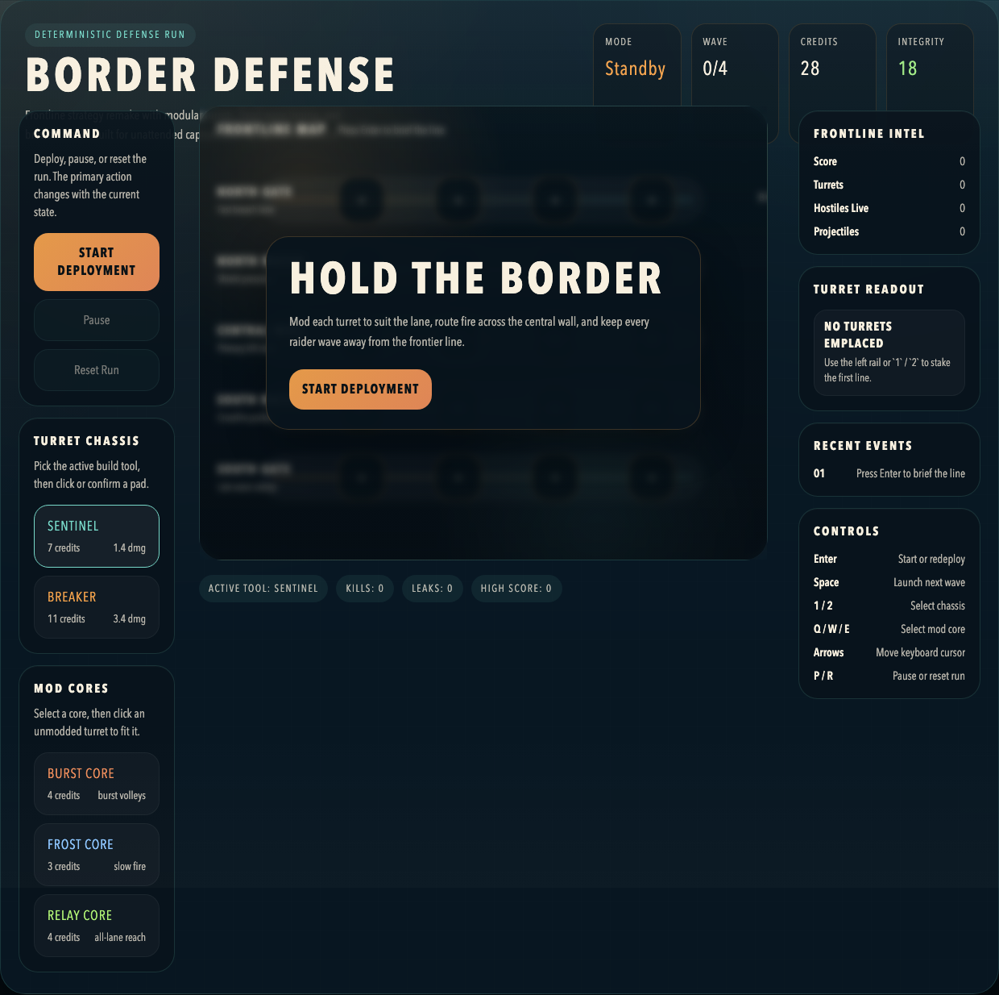
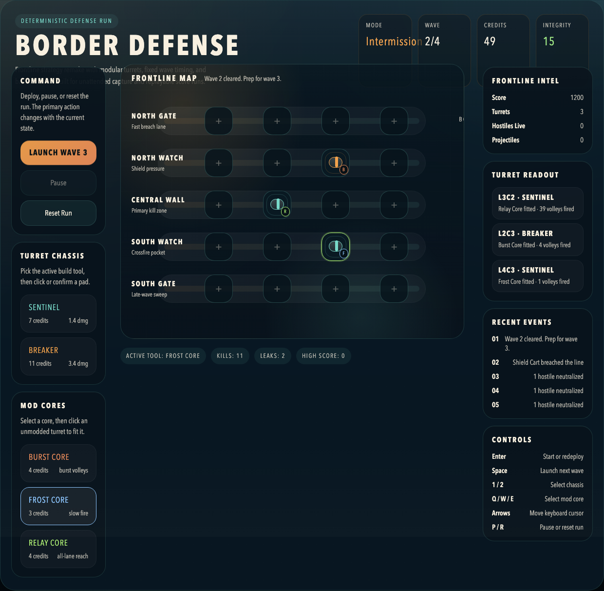
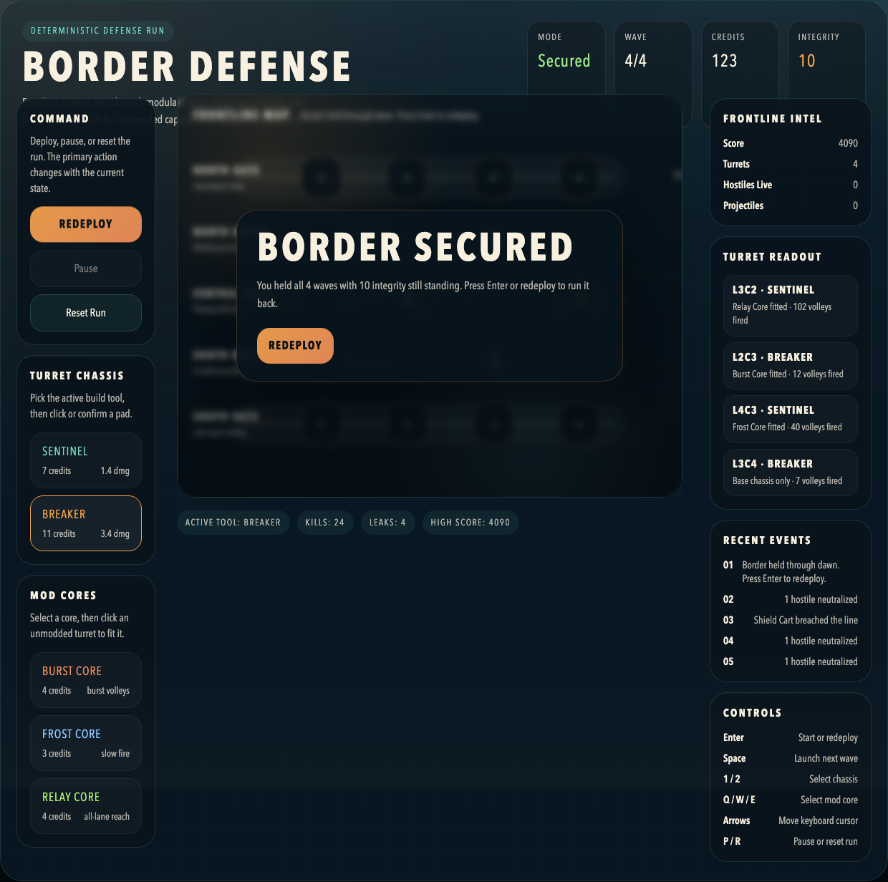

# daily-classic-game-2026-04-29-border-defense-turret-mods

  <h3>Border Defense rebuilt as a deterministic five-lane frontier command sim with modular turrets, escalating wave pressure, and an art-directed control bunker UI.</h3>
  
Stage the opening line, fit each turret with the right core, and hold four scripted waves before the border collapses.

  
  
  

## Quick Start
- `pnpm install`
- `pnpm dev`
- Open `http://127.0.0.1:4173/src/`

## How To Play
- Press `Enter` to open the deployment phase from the title screen, then press `Enter` again after a win or loss to redeploy.
- Press `Space` or click `Launch Wave` to send the next deterministic wave once your line is ready.
- Use `1` and `2` to arm `Sentinel` or `Breaker` chassis, then click a build pad or move the cursor with the arrow keys and press `X`.
- Use `Q`, `W`, and `E` to arm `Burst`, `Frost`, or `Relay` cores, then click an unmodded turret to fit that core.
- Press `P` to pause an active wave and `R` to reset the run back to deployment.

## Rules
- Raiders advance across five named sectors on fixed timing, so identical inputs always produce identical outcomes.
- Each turret occupies one build pad and can only receive one mod core for the full run.
- Clearing a wave opens an intermission with bonus credits before the next push begins.
- Every leak removes border integrity based on enemy class; if integrity reaches zero, the run ends immediately.
- Hold through all four waves to secure the frontier and bank the integrity bonus.

## Scoring
- `Runner` defeats award `60` score and `4` credits.
- `Shield Cart` defeats award `120` score and `6` credits.
- `Siege Tank` defeats award `240` score and `10` credits.
- Every cleared wave adds a `160 x wave` control bonus.
- Victory converts surviving border integrity into a `45 x integrity` final bonus.

## Twist
- **Turret Mods**: each emplaced turret can be tuned with one permanent core that shifts its battlefield role.
- `Burst Core` boosts damage and adds extra volleys every third firing cycle.
- `Frost Core` trades a little damage for slow effects and safer lane control.
- `Relay Core` extends range and lane reach so one anchor turret can cover the whole wall.

## Verification
- `pnpm test`
- `pnpm build`
- `pnpm capture`
- Browser hook: `window.advanceTime(ms)`
- Browser hook: `window.render_game_to_text()`
- Scripted route anchor 1: relay-fit `Sentinel` at `L3C2`
- Scripted route anchor 2: burst-fit `Breaker` at `L2C3`
- Scripted route anchor 3: frost-fit `Sentinel` at `L4C3`
- Scripted route anchor 4: final `Breaker` at `L3C4`

## Project Layout
- `src/` gameplay code and UI
- `assets/` static visual assets
- `docs/plans/` implementation notes and capture payloads
- `tests/` deterministic simulation checks
- `scripts/` build, self-check, and capture scripts
- `dist/` static deploy output
- `artifacts/playwright/` screenshots, GIFs, and the final text render dump

## GIF Captures
- `clip-01-frontier-loadout.gif` - opening deployment and relay fit on the central wall
- `clip-02-mod-core-fit.gif` - intermission expansion into the frost support lane
- `clip-03-final-border-hold.gif` - the last breaker drop and the four-wave secure finish
